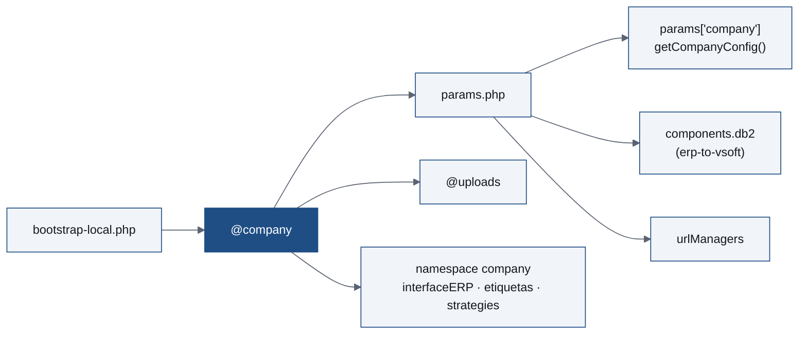

<p class="meta">Formação Interna · Equipa de Desenvolvimento</p>

# Submódulos de Empresa

<div class="rule"></div>

<p class="lead">Um repositório por cliente, um core sem clientes.</p>

<p class="meta mt-10">VSoft Industry</p>
<p class="meta-sub mt-2">Afonso Santos · Guilherme Camacho · 25/09/2026</p>

<div class="absolute bottom-10 left-14 flex items-center gap-6">
  
</div>

<!--
Hoje vamos ver como o código e a configuração de cada cliente saem do core do VSoft Industry para um submódulo git próprio. Porque o fizemos, como está montado, e como migramos um cliente.
-->

---

# Agenda

<div class="agenda mt-8">
  <div class="agenda-item"><span class="agenda-num">01</span><span>O problema</span></div>
  <div class="agenda-item"><span class="agenda-num">05</span><span>O que mudou no core</span></div>
  <div class="agenda-item"><span class="agenda-num">02</span><span>O alias <code>@company</code></span></div>
  <div class="agenda-item"><span class="agenda-num">06</span><span>Comandos <code>company/*</code></span></div>
  <div class="agenda-item"><span class="agenda-num">03</span><span>Estrutura do submódulo</span></div>
  <div class="agenda-item"><span class="agenda-num">07</span><span>Migrar um cliente</span></div>
  <div class="agenda-item"><span class="agenda-num">04</span><span><code>params.php</code></span></div>
  <div class="agenda-item"><span class="agenda-num">08</span><span>Deploy, testes e rollback</span></div>
</div>

<!--
Oito partes. A primeira metade é a arquitetura; a segunda é o guia prático de migração, que também está na tarefa do ClickUp.
-->

---

<p class="meta">Parte 01 · O problema</p>

# O core sabe demasiado sobre os clientes

<ul class="plain-list mt-2">
<li>Código de cada cliente dentro do core: <code>common/interfaceERP/&lt;CLIENTE&gt;/</code>, <code>common/etiquetas/config/&lt;CLIENTE&gt;/</code>, <code>common/etiquetas/etiquetaProduto/&lt;CLIENTE&gt;/</code>.</li>
<li>Logótipos de todos em <code>backend/web/logotipos-clientes/</code>.</li>
<li>Configuração espalhada: <code>db2.php</code>, <code>main-local.php</code>, <code>params-local.php</code>, <code>ConfigVSoft</code>.</li>
<li><strong>Credenciais de ERP de vários clientes</strong> no mesmo ficheiro, em todas as instalações.</li>
</ul>

<p class="dim mt-6">Cada instalação leva o código e os segredos de todos os outros. Atualizar um cliente arrisca partir outro.</p>

<!--
Antes, cada instalação tinha o código de todos os clientes. O params-local.php tinha as credenciais do PHC da Pearlizplas e do SAP da MGR lado a lado. Um update genérico podia tocar em código que só existia para um cliente.
-->

---

# O que queremos

<div class="grid grid-cols-3 gap-4 mt-8">
  <div class="check-card">
    <p class="check-title">Um cliente por instalação</p>
    <p class="dim">Cada servidor ativa um só submódulo <code>company_&lt;cliente&gt;</code> — sem código nem credenciais de outros.</p>
  </div>
  <div class="check-card">
    <p class="check-title">Core genérico</p>
    <p class="dim">O core referencia <code>company\...</code> sem saber qual é o cliente — sem pastas nem <code>if</code>s por cliente.</p>
  </div>
  <div class="check-card">
    <p class="check-title">Atualizar sem partir</p>
    <p class="dim">Core e cliente versionados à parte — um update genérico não toca noutro cliente.</p>
  </div>
</div>

<p class="dim mt-8">Mesma ideia já usada no <strong>Multifeed Web</strong>, adaptada ao Industry.</p>

<!--
Três objetivos. Isolamento, core genérico, e atualizações independentes. Já tínhamos feito uma primeira abordagem no Multifeed Web; aqui replicamos com os ajustes necessários.
-->

---
layout: two-cols-header
class: code-sm
---

# Antes e depois

::left::

<div class="pr-4">
<p class="code-label">Antes · tudo no core</p>

```
vsoft-plastics/
├── backend/web/
│   ├── logotipos-clientes/MGR/ …
│   └── uploads/
├── common/
│   ├── config/db2.php
│   ├── config/params-local.php
│   ├── etiquetas/config/MGR/
│   ├── etiquetas/config/PEARLIZPLAS/
│   ├── interfaceERP/MGR/
│   ├── interfaceERP/PEARLIZPLAS/
│   └── strategies/MGRCalculation.php
```
</div>

::right::

<div class="pl-4">
<p class="code-label accent">Depois · um submódulo por cliente</p>

```
vsoft-plastics/
├── common/          ← só código genérico
├── company_pearlizplas/   (submódulo)
│   ├── params.php
│   ├── interfaceERP/
│   ├── etiquetas/
│   ├── assets/
│   └── uploads/
└── company_mgr/           (submódulo)
```
</div>

<!--
À esquerda, o core com pastas por cliente. À direita, o core só com código genérico e cada cliente num repositório à parte, ligado como submódulo git.
-->

---
class: code-sm
---

<p class="meta">Parte 02 · O alias @company</p>

# Cada servidor escolhe o seu cliente

<p class="code-label mt-2">common/config/bootstrap-local.php <span class="dim">· não versionado</span></p>

```php
Yii::setAlias('@company', dirname(__DIR__, 2) . '/company_pearlizplas');
```

<p class="code-label mt-3">common/config/bootstrap.php</p>

```php
require __DIR__ . '/bootstrap-local.php';   // se faltar: RuntimeException
if (!is_dir(Yii::getAlias('@company'))) {
    throw new \RuntimeException('O @company ... não existe');
}
Yii::setAlias('@uploads', '@company/uploads');
```

<p class="dim mt-3 text-sm">Criado pelo <code>php init</code> a partir de <code>environments/{dev,prod}/</code> — trocar <code>company_CLIENTE</code> pelo submódulo.</p>

<!--
Tudo gira à volta de um alias. O bootstrap-local.php diz qual é a pasta do cliente ativo. Se o ficheiro faltar, ou a pasta não existir, a app falha logo no arranque com uma mensagem clara — nunca arranca a meio.
-->

---

# De onde vem cada coisa



<ul class="plain-list mt-6">
<li>Um só ponto de entrada: <strong>o alias decide tudo o resto</strong>.</li>
<li>O namespace <code>company\</code> resolve para <code>@company</code> — sem sufixo de cliente, porque só há um ativo.</li>
</ul>

<!--
A partir do alias: os parâmetros, os uploads, e o namespace company. O db2 e os urlManagers passam a sair do params.php do cliente.
-->

---
class: code-sm
---

<p class="meta">Parte 03 · Estrutura do submódulo</p>

# O template do cliente

```
company_<cliente>/
├── params.php               # configuração do cliente (única fonte)
├── interfaceERP/
│   ├── Commands.php         # extends AbstractCommandsERP
│   └── Integracoes.php      # implements IntegracoesERPInterface
├── etiquetas/
│   ├── Etiquetas.php  ·  GestaoEtiquetas.php
│   └── etiquetaProduto/     # .lbl, .prn, .png
├── strategies/              # fórmula de cálculo própria (opcional)
├── assets/                  # logótipos + styles.css
├── advancedQueryManager/data/   # consultas do gestor (ignorado pelo git)
└── uploads/                 # todos os uploads (ignorado pelo git)
```

<p class="dim mt-3 text-sm">A partir de <code>vsoft-industry-company-template</code> → repositório <strong>privado</strong> <code>vsoft-industry-company-{cliente}</code>. Nome: minúsculas, sem espaços, sem acentos.</p>

<!--
O template no GitHub tem esta estrutura. Cada cliente novo é um "Use this template". Privado, porque vai ter credenciais. Nome em minúsculas, espaços trocados por underscore, sem acentos: Rações XPTO fica racoes_xpto.
-->

---
class: code-sm
---

<p class="meta">Parte 04 · params.php</p>

# A configuração do cliente num só ficheiro

```php {all|2|3-6|7|8-11}
return [
    'company' => 'PEARLIZPLAS',
    'integrations' => [
        'erp-to-vsoft' => ['dsn' => 'sqlsrv:...', ...],   // leitura (db2)
        'vsoft-to-erp' => ['baseURL' => '...', ...],      // escrita (API ERP)
    ],
    'urlManagers' => ['urlManagerBackend' => ['baseUrl' => '/vsoftplastics/...']],
    'branding' => ['logo' => 'logo.png', 'loginBackground' => 'backgroud-login.png'],
    'autorizaPausa' => 'true', 'integrarConsumos' => true, 'utilizarCortante' => 0,
    'codigoBarras' => [/* identificadores GS1 */],
    'calculationStrategyClass' => company\strategies\Calculation::class, // opcional
];
```

<!--
Um ficheiro PHP simples, sem params-local por cima. Nome, ligação ao ERP para leitura, credenciais do ERP para escrita, URLs desta instalação, branding, flags, código de barras, e opcionalmente a fórmula de cálculo.
-->

---
class: text-sm
---

# O que o `params.php` substitui

| Chave | Antes |
|---|---|
| `company` | `ConfigVSoft::empresa` |
| `integrations.erp-to-vsoft` | `common/config/db2.php` (continua a ser `Yii::$app->db2`) |
| `integrations.vsoft-to-erp` | Bloco do cliente em `params-local.php` (PHC, SAP, ...) |
| `urlManagers` | `urlManager*` em `common/config/main-local.php` |
| `branding.*` | `backend/web/logotipos-clientes/<CLIENTE>/` |
| `calculationStrategyClass` | `params-local.php` do core |

<p class="dim mt-6"><code>timezone</code>, <code>anexos_tamanho_maximo_mb</code> e caminhos de etiquetas <strong>não</strong> vivem aqui — continuam em <code>tbConfigApp</code>, ajustáveis sem deploy.</p>

<!--
Esta tabela é o mapa para quem migra: de onde vinha cada valor. Atenção: o que é ajustável em runtime continua em Configurações do Projeto, não no params.php.
-->

---
layout: two-cols-header
class: code-sm
---

<p class="meta">Parte 05 · O que mudou no core</p>

# Ler a configuração do cliente

::left::

<div class="pr-4">
<p class="code-label">common/helpers/functions.php</p>

```php
function getCompanyConfig(
    string $key, $default = null
) {
    return ArrayHelper::getValue(
        Yii::$app->params['company'], $key, $default
    );
}
```

<p class="dim mt-3">Notação de pontos: <code>getCompanyConfig('branding.logo')</code></p>
</div>

::right::

<div class="pl-4">
<p class="code-label accent">CalculationStrategyFactory.php</p>

```php
public static function create():
    CalculationStrategyInterface
{
    $class = getCompanyConfig(
        'calculationStrategyClass',
        GenericCalculation::class
    );
    return new $class();
}
```

<p class="dim mt-3">Sem chave → <code>GenericCalculation</code> do core.</p>
</div>

<!--
Um helper global para ler o params do cliente. O primeiro uso é a estratégia de cálculo: o cliente aponta para a sua classe em company\strategies, ou fica com a genérica.
-->

---
class: code-sm
---

# ERP e etiquetas: namespaces fixos

```php
namespace common\interfaceERP;

use company\interfaceERP\Commands;     // sempre a mesma classe, qualquer cliente
use company\interfaceERP\Integracoes;

class ErpManager
{
    public function getClientes()
    {
        return (new Commands())->listaClientes($this->queryParams);
    }
}
```

<ul class="plain-list mt-4">
<li><code>ErpManager</code> e <code>EtiquetasVsoft</code> já não escolhem a classe pelo nome do cliente.</li>
<li><code>Commands.php</code> só sobrepõe os métodos de <code>AbstractCommandsERP</code> <strong>que mudam</strong> para este cliente.</li>
</ul>

<!--
Antes havia seleção dinâmica pelo nome da empresa. Agora é um use direto de company\interfaceERP\Commands — quem responde é o submódulo ativo. E no Commands do cliente, só se escrevem os métodos que diferem do comportamento standard.
-->

---
layout: two-cols-header
---

# Branding: `assets/`

::left::

<div class="pr-6">
<p class="meta">Páginas no browser</p>

```php
Url::to(['/company-assets/logotipo',
    'ficheiro' => $logo])
```

<p class="meta accent mt-6">Templates PDF (dompdf)</p>

```php
Yii::getAlias('@company')
    . '/assets/' . $logo
```

<p class="dim mt-2 text-sm">Nunca a rota HTTP no PDF: o logótipo desaparece em silêncio.</p>
</div>

::right::

<div class="pl-6">
<p class="meta">assets/styles.css</p>

```css
:root {
  --cor-empresa: #2071EB;
  --cor-empresa-hover: #020D78;
}
```

<ul class="plain-list mt-4 text-sm">
<li>Injetado no <code>&lt;head&gt;</code> de todos os layouts (<code>_companyStyles.php</code>).</li>
<li><code>assets/</code> é a <strong>única cópia</strong> — nada duplicado no webroot.</li>
</ul>
</div>

<!--
Os logótipos vivem fora do webroot e são servidos pelo CompanyAssetsController, que valida o caminho. Duas formas de os referenciar: rota para o browser, caminho local para o dompdf. As cores do cliente passam a variáveis CSS.
-->

---

# Uploads: `@uploads`

```apache
# backend/web/.htaccess — os URLs antigos continuam a funcionar
RewriteCond %{REQUEST_FILENAME} !-f
RewriteRule ^uploads/(.+)$ index.php?r=company-assets/upload&ficheiro=$1 [B,L,QSA]
```

<div class="grid grid-cols-3 gap-4 mt-6">
  <div class="check-card">
    <p class="check-title">Guardar / apagar</p>
    <p class="dim text-sm">Sempre via <code>AnexoFileBaseService</code> (<code>guardarFicheiro()</code>, <code>apagarFicheiro()</code>)</p>
  </div>
  <div class="check-card">
    <p class="check-title">Servir</p>
    <p class="dim text-sm"><code>/uploads/...</code> → rota <code>company-assets/upload</code></p>
  </div>
  <div class="check-card">
    <p class="check-title">PDF</p>
    <p class="dim text-sm"><code>getUploadsPath('pasta') . $ficheiro</code>, nunca o URL</p>
  </div>
</div>

<p class="dim mt-4">Mesma estrutura de pastas de <code>backend/web/uploads/</code>. Limite único: <code>anexos_tamanho_maximo_mb</code> (default 10 MB).</p>

<!--
Os uploads saem do webroot para company/uploads. O .htaccess reencaminha os URLs antigos, por isso nenhum link existente parte — desde que o mod_rewrite esteja ativo. Todos os serviços de anexos passam pelo AnexoFileBaseService.
-->

---

# Gestor de consultas

<p class="code-label mt-2">common/modules/advancedQueryManager/config.php</p>

```php
"advancedQueryManagerDataStorage" => "company", // "company" | "module"
```

<ul class="plain-list mt-6">
<li><code>company</code> (default) → <code>@company/advancedQueryManager/data/</code></li>
<li><code>module</code> → dentro do próprio módulo, como antes</li>
<li>As consultas <code>.dat</code> de cada cliente <strong>ficam com o cliente</strong>, não no core.</li>
</ul>

<!--
O gestor de consultas guarda os ficheiros de dados no submódulo do cliente. Há um interruptor para voltar ao comportamento antigo, se for preciso.
-->

---
class: text-sm
---

<p class="meta">Parte 06 · Comandos company/*</p>

# Três comandos: `php yii company/...`

| Comando | O que faz |
|---|---|
| `init <nome>` | Checkout (ou `git submodule add`) de `company_<nome>` e escreve o `bootstrap-local.php` |
| `check-template` | Clona o template e lista os ficheiros <strong>em falta</strong> em cada `company_*` |
| `migrate-uploads` | Move `backend\|frontend\|picking/web/uploads` para `@uploads`, sem substituir |

```
$ php yii company/migrate-uploads                        # exemplo
  já existe, ignorado: maquinas/12.png
Movidos: 1843 | Já existentes: 1 | Erros: 0
```

<!--
O init corre mesmo sem @company definido — é por isso que existe. O check-template só aponta ficheiros em falta; conteúdo diferente é personalização do cliente e é ignorado. O migrate-uploads nunca substitui: o que já existe no destino fica na origem para rever à mão.
-->

---

<p class="meta">Parte 07 · Migrar um cliente</p>

# Criar o submódulo

<ol class="mt-4">
<li>GitHub → <em>Use this template</em> → <code>vsoft-industry-company-{cliente}</code> (privado).</li>
<li v-click>Mover o código do core: <code>interfaceERP/&lt;CLIENTE&gt;/</code>, <code>etiquetas/config/&lt;CLIENTE&gt;/</code>, <code>etiquetaProduto/&lt;CLIENTE&gt;/</code>, fórmula própria → <code>strategies/</code>.</li>
<li v-click>Trocar namespaces para <code>company\interfaceERP</code>, <code>company\etiquetas</code>, <code>company\strategies</code> — e procurar referências antigas.</li>
<li v-click>Preencher o <code>params.php</code> (db2, credenciais ERP, <code>baseUrl</code>, flags).</li>
<li v-click>Logótipos e fundo do login em <code>assets/</code> — <strong>versão mais recente, da produção</strong>. Cores em <code>styles.css</code>.</li>
<li v-click>Commit e push. No core: <code>git submodule add &lt;url&gt; company_&lt;cliente&gt;</code>.</li>
</ol>

<!--
Uma vez por cliente. Atenção aos logótipos: os que estavam no repositório podem estar desatualizados, ir sempre buscar à instalação em produção.
-->

---
class: code-sm
---

# Namespaces: antes e depois

| Antes | Depois |
|---|---|
| `common\interfaceERP\PEARLIZPLAS\Commands` | `company\interfaceERP\Commands` |
| `common\interfaceERP\PEARLIZPLAS\Integracoes` | `company\interfaceERP\Integracoes` |
| `common\etiquetas\config\PEARLIZPLAS\Etiquetas` | `company\etiquetas\Etiquetas` |
| `common\etiquetas\config\PEARLIZPLAS\GestaoEtiquetas` | `company\etiquetas\GestaoEtiquetas` |
| `common\strategies\<CLIENTE>Calculation` | `company\strategies\Calculation` |

```bash
# procurar referências que ficaram para trás
grep -rn "PEARLIZPLAS" --include=*.php common backend frontend console
```

<p class="dim mt-4">Sem sufixo de cliente: só existe um cliente ativo por instalação.</p>

<!--
O passo que mais facilmente fica a meio. Depois de mover, procurar o nome do cliente em namespaces no core todo.
-->

---

<p class="meta">Parte 08 · Deploy, testes e rollback</p>

# Deploy numa instalação existente

<div class="grid grid-cols-3 gap-4 mt-4 text-sm">
  <div class="check-card">
    <p class="check-title">Antes</p>
    <ol>
      <li>Backup da BD</li>
      <li>Backup de <code>*/web/uploads/</code></li>
      <li>Backup de <code>common/config/*-local.php</code></li>
      <li>Valores antigos já no <code>params.php</code></li>
    </ol>
  </div>
  <div class="check-card">
    <p class="check-title">Servidor</p>
    <ol>
      <li><code>bootstrap-local.php</code> a apontar ao submódulo</li>
      <li>Apache: <code>mod_rewrite</code> + <code>AllowOverride FileInfo</code></li>
      <li>Escrita em <code>company_*/uploads/</code></li>
      <li><code>php.ini</code>: 200M, 4G</li>
    </ol>
  </div>
  <div class="check-card">
    <p class="check-title">Migrar</p>
    <ol>
      <li><code>company/migrate-uploads</code></li>
      <li>Confirmar <strong>Erros: 0</strong></li>
      <li>Rever os "já existe"</li>
      <li><code>php yii cache/flush cache</code></li>
    </ol>
  </div>
</div>

<p class="dim mt-4">Sem <code>mod_rewrite</code>, as imagens e documentos antigos deixam de abrir.</p>

<!--
Três blocos. Backups primeiro. Depois o servidor: o Apache precisa de mod_rewrite e AllowOverride, senão os URLs antigos de uploads dão 404. Por fim, migrar os ficheiros e limpar a cache. Nota: no cliente não há git pull; o build do projeto com o company ainda está em curso.
-->

---

# Testes depois do deploy

<div class="grid grid-cols-3 gap-4 mt-6">
  <div class="check-card">
    <p class="check-title">Login e backend</p>
    <p class="dim text-sm">Logótipo, fundo, cores dos botões; logótipo no topo; página 404</p>
  </div>
  <div class="check-card">
    <p class="check-title">Imagens antigas</p>
    <p class="dim text-sm">Máquina, ficha técnica, foto de utilizador — backend e kiosk</p>
  </div>
  <div class="check-card">
    <p class="check-title">Uploads novos</p>
    <p class="dim text-sm">Imagem de máquina (com thumbnail), documento da ficha técnica, PDF de receção</p>
  </div>
  <div class="check-card">
    <p class="check-title">PDFs</p>
    <p class="dim text-sm">Ficha técnica com imagem, ordem de produção, relatório de ensaio, packing list</p>
  </div>
  <div class="check-card">
    <p class="check-title">ERP</p>
    <p class="dim text-sm">Leitura via db2 (<code>erp-to-vsoft</code>) e envio de um documento (<code>vsoft-to-erp</code>)</p>
  </div>
  <div class="check-card">
    <p class="check-title">Etiquetas</p>
    <p class="dim text-sm">Imprimir uma etiqueta de produto</p>
  </div>
</div>

<!--
Seis verificações, uma por cada peça que mudou: branding, uploads antigos e novos, PDFs com o dompdf, ERP nos dois sentidos, e etiquetas.
-->

---

# Rollback

<ol class="mt-6 text-lg">
<li>Voltar ao commit anterior: <code>git checkout &lt;anterior&gt;</code> + <code>git submodule update</code>.</li>
<li>Repor os ficheiros de <code>company_&lt;cliente&gt;/uploads/</code> em <code>backend/web/uploads/</code>, com a mesma estrutura.</li>
<li>Repor <code>db2.php</code> e <code>main-local.php</code> do backup.</li>
</ol>

<p class="lead mt-10">Por isso os backups antes do deploy não são opcionais.</p>

<!--
Se algo correr mal, três passos. Só funciona se tiverem sido feitos os backups antes.
-->

---

# Ponto de situação

<div class="grid grid-cols-2 gap-6 mt-6">
  <div class="check-card">
    <p class="check-title">Feito · <code>feature/company-submodules</code></p>
    <ul class="text-sm">
      <li>Template no GitHub</li>
      <li><code>company_pearlizplas</code> e <code>company_mgr</code> como submódulos</li>
      <li>ERP, etiquetas, estratégias, consultas, branding, uploads</li>
      <li><code>db2</code> e <code>urlManagers</code> no <code>params.php</code></li>
      <li>Comandos <code>company/*</code></li>
    </ul>
  </div>
  <div class="check-card">
    <p class="check-title">Em curso</p>
    <ul class="text-sm">
      <li>Build do projeto + company para o cliente (sem git no servidor)</li>
      <li>Migrar os restantes clientes do core</li>
      <li>Review do branch</li>
    </ul>
  </div>
</div>

<p class="dim mt-6">O branch remove ~11 000 linhas do core (código de cliente e limpeza).</p>

<!--
Pearlizplas e MGR já estão em submódulo no branch. Falta resolver o build para instalações sem git e migrar os restantes clientes, um a um, com o guia que vimos.
-->

---

# Próximos passos

<div class="grid grid-cols-3 gap-8 mt-10">
  <div class="step">
    <span class="step-num">01</span>
    <p class="step-title">Uma empresa por pessoa</p>
    <p class="dim">Cada pessoa recebe a tarefa de migrar uma empresa para o submódulo <code>company_&lt;cliente&gt;</code>.</p>
  </div>
  <div class="step">
    <span class="step-num">02</span>
    <p class="step-title">Seguir o guia</p>
    <p class="dim">Criar o submódulo, deploy, testes e rollback — passo a passo.</p>
  </div>
  <div class="step">
    <span class="step-num">03</span>
    <p class="step-title">Erros ou melhorias?</p>
    <p class="dim">Deixar em <strong>comentário</strong> na tarefa, para o guia ficar sempre atualizado.</p>
  </div>
</div>

<a href="https://app.clickup.com/t/12493t4jtke" target="_blank" class="task-link mt-10">
  <span>
    <span class="code-label">Guia · ClickUp</span>
    <span class="task-name">Tarefas para migração</span>
  </span>
  <code>#12493t4jtke</code>
</a>

<!--
A partir de agora, cada um fica com uma empresa para migrar. O guia passo a passo está na tarefa do ClickUp. Se encontrarem erros no guia ou algo que possa ser melhorado, deixem em comentário na tarefa.
-->

---
layout: end
class: text-center
---

# Perguntas?

<div class="rule"></div>

<p class="lead">README em <code>vsoft-industry-company-template</code></p>

<div class="absolute bottom-10 left-1/2 -translate-x-1/2 flex items-center gap-6">
  
</div>

<!--
Obrigado. O README do template tem a estrutura e os comandos git para gerir submódulos; o guia de migração está na tarefa do ClickUp.
-->
