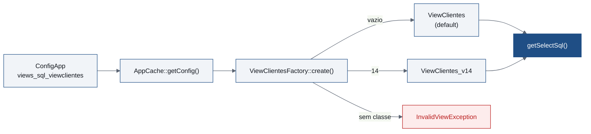

<p class="meta">Formação Interna · Equipa de Desenvolvimento</p>

# Views SQL Versionadas

<div class="rule"></div>

<p class="lead">Mecanismo de versionamento de views SQL para integração.</p>

<p class="meta mt-10">VSoft Industry</p>
<p class="meta-sub mt-2">Afonso Santos · afonso.santos@visionsoft.pt · 16/09/2026</p>

<div class="absolute bottom-10 left-14 flex items-center gap-6">
  
</div>

<!--
Hoje vamos falar sobre o mecanismo de versionamento das views SQL de integração. Porque existe, como está estruturado, e como o usamos no dia-a-dia.
-->

---

# Agenda

<div class="agenda mt-8">
  <div class="agenda-item"><span class="agenda-num">01</span><span>O problema</span></div>
  <div class="agenda-item"><span class="agenda-num">05</span><span>Adicionar uma revisão antiga</span></div>
  <div class="agenda-item"><span class="agenda-num">02</span><span>Estrutura de um pacote</span></div>
  <div class="agenda-item"><span class="agenda-num">06</span><span>Como usar</span></div>
  <div class="agenda-item"><span class="agenda-num">03</span><span>Criar um pacote novo</span></div>
  <div class="agenda-item"><span class="agenda-num">07</span><span>Página de teste</span></div>
  <div class="agenda-item"><span class="agenda-num">04</span><span>Criar uma nova revisão</span></div>
  <div class="agenda-item"><span class="agenda-num">08</span><span>Checklist</span></div>
</div>

<!--
Oito partes. Vamos usar sempre o mesmo exemplo, ViewClientes, do problema até à checklist.
-->

---

<p class="meta">Parte 01 · O problema</p>

# As views são geridas por terceiros

<ul class="plain-list mt-2">
<li>As <em>views</em> de integração (<code>ViewClientes</code>, <code>ViewArmazens</code>, <code>ViewEncomendasCliente</code>, ...) são criadas e mantidas por <strong>empresas terceiras</strong>.</li>
<li>O Manual de Integração evolui e as views passam a ter <strong>colunas novas</strong> (ou perdem outras).</li>
<li><strong>Nem todos os clientes atualizam a view ao mesmo tempo.</strong></li>
</ul>

<p class="code-label mt-4">Sem mecanismo de versões</p>

```sql
SELECT id, codigoCliente, nomeCliente, nifCliente, emailCliente, isAtivo FROM ViewClientes
-- Invalid column name 'emailCliente' (cliente ainda não tem a coluna)
```

<p class="dim mt-4">A query deixa de funcionar assim que um cliente fica atrasado numa coluna nova.</p>

<!--
As views são de terceiros, uma por cliente. Quando o manual evolui, nem todos os clientes atualizam ao mesmo tempo. Um SELECT fixo com todas as colunas deixa de funcionar assim que um cliente fica atrasado.
-->

---

# O que queremos

<div class="grid grid-cols-3 gap-4 mt-8">
  <div class="check-card">
    <p class="check-title">Mesmo método</p>
    <p class="dim">O código PHP chama sempre o mesmo método — nunca escreve a lista de colunas à mão.</p>
  </div>
  <div class="check-card">
    <p class="check-title">Revisão decide</p>
    <p class="dim">A revisão configurada por cliente decide que campos a view realmente tem.</p>
  </div>
  <div class="check-card">
    <p class="check-title">Nunca parte</p>
    <p class="dim">Campos em falta saem como <code>NULL</code> (ou valor por defeito) — a query funciona sempre.</p>
  </div>
</div>

<p class="lead mt-8">Revisão nova = uma classe nova. Nada muda nos <code>Commands.php</code>.</p>

<!--
O objetivo: o mesmo código de chamada para todos, a revisão configurada decide as colunas, e a query nunca parte.
-->

---

<p class="meta">Parte 02 · Estrutura de um pacote</p>

# Uma pasta por entidade

```
common/models/views/
├── AbstractViewModelVersion.php   # motor comum (não duplicar)
├── AbstractViewModelFactory.php   # base comum das factories
└── Clientes/
    ├── ViewClientes.php           # classe default: revisão inicial, nunca muda
    ├── ViewClientes_v14.php       # revisão v14 (delta face à default)
    └── ViewClientesFactory.php    # factory desta entidade
```

<p class="lead mt-8">Convenção: <code>View{Entidade}.php</code>, <code>View{Entidade}_v{N}.php</code>, <code>View{Entidade}Factory.php</code>.</p>

<!--
Cada entidade tem a sua pasta, sempre com os mesmos nomes. Duas peças são partilhadas por todas: o motor e a factory base.
-->

---
class: code-sm
---

# Anatomia da classe *default* (1/2)

<p class="dim mt-1">Os três métodos que definem os campos da view</p>

```php {all|3-6|7-10|11-14}
class ViewClientes extends AbstractViewModelVersion
{
    protected function getAllFields(): array // todos os campos desta revisão
    {
        return ['id', 'codigoCliente', 'nomeCliente', 'nifCliente', 'isAtivo'];
    }
    protected function getMissingFieldDefaults(): array // defaults p/ campos em falta
    {
        return ['nifCliente' => ''];
    }
    protected function getFieldsInThisVersion(): array // o que ESTA revisão suporta
    {
        return $this->getAllFields();
    }
}
```

<!--
Três métodos. Todos os campos, os defaults para os que faltam, e os campos desta revisão. Na default são iguais.
-->

---
class: code-sm
---

# Anatomia da classe *default* (2/2)

<p class="dim mt-1">Identificação da view, chave de configuração, e campos garantidos</p>

```php {all|3-6|7-10|11-14}
class ViewClientes extends AbstractViewModelVersion // (continuação)
{
    public function getViewName(): string // nome FÍSICO da view SQL
    {
        return "ViewClientes"; // ViewUtilizadores -> "ViewUsers"
    }
    public function getVersionConfigKey(): string // chave em ConfigApp
    {
        return "views_sql_viewclientes";
    }
    protected function getRequiredFields(): array // campos garantidos pela app
    {
        return ['id', 'codigoCliente', 'nomeCliente', 'isAtivo'];
    }
}
```

<!--
O nome físico da view, a chave de configuração, e os campos obrigatórios — estes últimos só servem para a página de teste assinalar revisões que não os fornecem.
-->

---
layout: two-cols-header
---

# O que o motor faz por nós

::left::

<div class="pr-10">
  <p class="meta">Chamamos sempre o mesmo código</p>

```php
$view = ViewClientesFactory::create($versao);
// '' = classe default (revisão inicial)

$sql = $view->getSelectSql('isAtivo = 1');
```

  <ul class="plain-list mt-6">
    <li>Campo em falta na revisão → <code>NULL</code> ou o valor de <code>getMissingFieldDefaults()</code></li>
    <li><strong>A query nunca deixa de funcionar</strong> por causa de uma coluna que o cliente não tem</li>
  </ul>
</div>

::right::

<div class="pl-4">
  <p class="meta accent">Cliente numa revisão sem nifCliente</p>

```sql
SELECT
  id, codigoCliente, nomeCliente,
  '' AS nifCliente, isAtivo
FROM ViewClientes
WHERE isAtivo = 1
```
</div>

<!--
O mesmo código de chamada, para qualquer cliente. O motor gera o SQL certo consoante a revisão configurada.
-->

---

<p class="meta">Parte 03 · Criar um pacote novo</p>

# Quando a view ainda não existe

<ol class="mt-6 text-lg">
<li>Criar a pasta <code>common/models/views/Clientes/</code>.</li>
<li v-click>Criar a classe <strong>default</strong> <code>ViewClientes.php</code>, com todos os métodos (ver <em>Anatomia da classe default</em>).</li>
<li v-click>Criar a <strong>factory</strong> <code>ViewClientesFactory.php</code> — só indica a classe default.</li>
<li v-click>Adicionar a chave <code>views_sql_viewclientes</code> em <code>RequisitosMinimos::KEYS</code>, categoria "Views SQL" → "Versões".</li>
<li v-click>Nos <code>Commands.php</code> (ou em <code>AbstractCommandsERP</code>), substituir o <code>FROM ViewClientes</code> literal por <code>ViewClientesFactory::create(...)->getSelectSql(...)</code>.</li>
</ol>

<!--
Cinco passos. Pasta, classe default, factory, chave de config, e trocar o FROM literal pelo mecanismo.
-->

---

# A factory

```php
class ViewClientesFactory extends AbstractViewModelFactory
{
    protected static function defaultClass(): string
    {
        return ViewClientes::class;
    }
}
```

<p class="meta mt-10">Nada a registar</p>
<p class="mt-3 dim">A pasta já é suficiente: a página <code>test-views/index</code> descobre automaticamente qualquer pasta com um <code>*Factory.php</code>.</p>

<!--
A factory só indica a classe default. Não é preciso registar o pacote nalgum sítio central.
-->

---
layout: two-cols-header
class: code-sm
---

# View nova numa revisão posterior

<p class="dim mt-1">Surge na v14 uma view nova: default vazia, campos na <code>_v14</code>.</p>

::left::

<div class="pr-2 mt-2">
<p class="code-label">ViewLotes.php <span class="dim">· default vazia</span></p>

```php
class ViewLotes extends AbstractViewModelVersion
{
    protected function getAllFields(): array
    { return []; }
    protected function getMissingFieldDefaults(): array
    { return []; }
    protected function getFieldsInThisVersion(): array
    { return []; }
    protected function getRequiredFields(): array
    { return []; }
    public function getViewName(): string
    { return "ViewLotes"; }
    public function getVersionConfigKey(): string
    { return "views_sql_viewlotes"; }
}
```
</div>

::right::

<div class="pl-2 mt-2">
<p class="code-label accent">ViewLotes_v14.php <span class="dim">· conteúdo real</span></p>

```php
class ViewLotes_v14 extends ViewLotes
{
    protected function getAllFields(): array
    { return ['id', 'codigoLote', 'dataValidade']; }
    protected function getFieldsInThisVersion(): array
    { return $this->getAllFields(); }
    protected function getRequiredFields(): array
    { return ['id', 'codigoLote']; }
    public function getViewName(): string
    { return "ViewLotes_v14"; }
}
```
</div>

<style>
.slidev-code { font-size: 12px !important; line-height: 17px !important; padding: 12px 14px !important; }
.col-left { padding-right: 0.75rem; }
.col-right { padding-left: 0.75rem; }
</style>

<!--
Caso especial do pacote novo: a view só aparece a meio, na v14. A classe sem versão continua a existir, mas vazia — é a revisão inicial, e aí a view não existia. Todo o conteúdo vai para a ViewLotes_v14. A factory é igual à de qualquer pacote. Os clientes com a view configuram views_sql_viewlotes = 14.
-->

---
class: code-sm
---

<p class="meta">Parte 04 · Criar uma nova revisão</p>

# O manual avança: `ViewClientes_v14`

```php {all|1|3-6|7-10|11-14}
class ViewClientes_v14 extends ViewClientes // a default nunca muda
{
    protected function getAllFields(): array // + emailCliente
    {
        return array_merge(parent::getAllFields(), ['emailCliente']);
    }
    protected function getFieldsInThisVersion(): array // - nifCliente → '' (default)
    {
        return array_values(array_diff($this->getAllFields(), ['nifCliente']));
    }
    public function getViewName(): string // view física nova
    {
        return "ViewClientes_v14";
    }
}
```

<div class="note-grid grid grid-cols-3 gap-6 mt-4">
  <div>
    <p class="meta">Acrescentar campo</p>
    <p class="dim">Adicionar em <code>getAllFields()</code></p>
  </div>
  <div>
    <p class="meta accent">Remover campo</p>
    <p class="dim">Tirar de <code>getFieldsInThisVersion()</code></p>
  </div>
  <div>
    <p class="meta">Nome da view</p>
    <p class="dim">Sobrepor <code>getViewName()</code> sempre</p>
  </div>
</div>

<!--
O Manual de Integração avança: a v14 traz emailCliente e deixa de ter nifCliente. Não mexemos na default: a classe nova acrescenta em getAllFields e remove em getFieldsInThisVersion, para o código PHP continuar a receber a chave nifCliente.
-->

---

# Apontar os clientes à nova revisão

<ul class="plain-list mt-6">
<li>Nome da classe <strong>tem de ser</strong> <code>ViewClientes_v14</code> — a factory resolve-o automaticamente.</li>
<li>O cliente não altera a view antiga: <code>ViewClientes</code> e <code>ViewClientes_v14</code> coexistem na BD. Uma <code>_v15</code> tem de sobrepor <code>getViewName()</code> outra vez.</li>
<li><strong>Não mexer na factory nem na classe default.</strong></li>
<li>Configurar <code>views_sql_viewclientes = 14</code> em ConfigApp, nos clientes que já têm a view v14.</li>
<li>Restantes clientes → chave vazia → classe default, <strong>sem alterações</strong>.</li>
</ul>

<p class="lead mt-10">Cada revisão nova é só uma classe nova — nada do que já existe muda.</p>

<!--
A classe nova segue a convenção de nome, a factory resolve sozinha, e a configuração do cliente diz qual usar. Quem não está na v14 não precisa de nada.
-->

---

<p class="meta">Parte 05 · Adicionar uma revisão antiga</p>

# Cliente numa revisão não mapeada

```php
// ViewClientes revisão v10 - sem o campo nifCliente
class ViewClientes_v10 extends ViewClientes
{
    protected function getFieldsInThisVersion(): array
    {
        return ['id', 'codigoCliente', 'nomeCliente', 'isAtivo'];
    }
}
```

<div class="note-grid grid grid-cols-2 gap-6 mt-6">
  <div>
    <p class="meta">Só sobrepõe getFieldsInThisVersion()</p>
    <p class="dim">Em falta → <code>NULL</code> ou valor por defeito</p>
  </div>
  <div>
    <p class="meta accent">Configurar o cliente</p>
    <p class="dim"><code>views_sql_viewclientes = 10</code> em ConfigApp</p>
  </div>
</div>

<!--
Descobre-se, depois de facto, que a view de um cliente não bate com nenhuma revisão mapeada. Exatamente a mesma técnica de remover campos numa revisão — só que reativa.
-->

---

# Três cenários, uma mecânica

| Cenário | Quando usar | O que se cria |
|---|---|---|
| **Pacote novo** | A view ainda não existe neste mecanismo | `ViewClientes.php` + `ViewClientesFactory.php` |
| **View nova a meio** | A view só surge numa revisão posterior (ex: v14) | `ViewLotes.php` (vazia) + `ViewLotes_v14.php` + factory |
| **Nova revisão** | O Manual de Integração avança — a view ganha/perde colunas | `ViewClientes_v14.php` |
| **Revisão antiga** | A view de um cliente não bate com nenhuma revisão mapeada | `ViewClientes_v10.php` |

<p class="lead mt-8">Em todos os casos: a default e a factory ficam intactas.</p>

<!--
Três cenários (mais a variante da view que surge a meio), mesma mecânica por baixo: uma classe por revisão e a configuração do cliente a escolher.
-->

---
layout: two-cols-header
class: code-sm
---

<p class="meta">Parte 06 · Como usar</p>

# Chamada + exemplo real

::left::

<div class="pr-6 mt-2">
<p class="code-label">AbstractCommandsERP.php <span class="dim">· genérico</span></p>

```php
protected function getClientesSql(): string
{
    $versao = AppCache::getConfig(
        'views_sql_viewclientes'
    );

    return ViewClientesFactory::create($versao)
        ->getSelectSql('isAtivo = 1');
}
```
</div>

::right::

<div class="pl-8 mt-2">
<p class="code-label accent">PEARLIZPLAS\Commands.php <span class="dim">· override</span></p>

```php
protected function getArmazens(): array
{
    $sql = ViewArmazensFactory::create(
        AppCache::getConfig(
            'views_sql_viewarmazens'
        )
    )->getSelectSql('isAtivo = 1');
    return $this->fixEncoding(
        $this->queryAll($sql)
    );
}
```
</div>

<!--
Na implementação genérica ou específica de cliente, sempre o mesmo padrão: factory, revisão configurada, getSelectSql. A diferença não está no mecanismo — está em onde o método vive: na classe base ou num override do cliente.
-->

---

# De onde vem a revisão a usar



<ul class="plain-list mt-6">
<li>Configuração <strong>por instalação</strong>, em Configurações do Projeto → <strong>Views SQL → Versões</strong> (cache invalidada ao gravar).</li>
<li>Revisão configurada sem classe correspondente → <strong>exceção</strong>, nunca assume a default em silêncio.</li>
</ul>

<!--
A revisão vem do ConfigApp, por cliente. Vazio é default. 14 resolve para a classe _v14. Preenchido sem classe correspondente é erro, de propósito.
-->

---
layout: two-cols-header
---

# Outros métodos úteis

::left::

<ul class="plain-list mt-4 pr-6">
<li><code>getFieldsAsArray()</code> — array pronto para SQL, ex: <code>["id", "nomeCliente", "'' AS nifCliente"]</code></li>
<li><code>getFieldsAsSelectString($showColumns = [])</code> — a mesma lista como string; <code>$showColumns</code> filtra só as colunas pedidas</li>
<li><code>getFieldsAsJsonElements($showColumns = [])</code> — formato <code>"chave": "valor"</code> para respostas <em>ajax</em></li>
</ul>

::right::

<ul class="plain-list mt-4 pl-6">
<li><code>getSelectSql($where = '', $showColumns = [])</code> — atalho <code>SELECT ... FROM ... [WHERE ...]</code> completo</li>
<li><code>ViewNamesTrait</code> — só o <strong>nome</strong> da view já resolvido (ex: <code>viewClientesName()</code>), para <em>JOINs</em> e SQL montado à mão</li>
</ul>

<p class="lead mt-6"><strong>Usar sempre que possível</strong>, em vez de montar SQL à mão.</p>

<!--
getSelectSql é o atalho a usar quase sempre.
-->

---

<p class="meta">Parte 07 · Página de teste</p>

# `test-views/index`

<ul class="mt-2">
<li>Descobre <strong>automaticamente</strong> todas as pastas com um <code>*Factory.php</code>.</li>
<li>Compara o <code>INFORMATION_SCHEMA.COLUMNS</code> real do cliente com a revisão configurada.</li>
</ul>

<div class="grid grid-cols-2 gap-2 mt-3">
  <div class="status-card status-ok">
    <p class="status-name">OK</p>
    <p class="status-desc">Todos os campos da revisão existem na view real</p>
  </div>
  <div class="status-card status-danger">
    <p class="status-name">VIEW MISSING</p>
    <p class="status-desc">A view não existe (ou não está visível)</p>
  </div>
  <div class="status-card status-warn">
    <p class="status-name">COLUMN MISSING</p>
    <p class="status-desc">Faltam colunas não-obrigatórias desta revisão</p>
  </div>
  <div class="status-card status-danger">
    <p class="status-name">MANDATORY FIELD MISSING</p>
    <p class="status-desc">Falta um campo que a app assume como garantido</p>
  </div>
</div>

<p class="dim mt-3">Primeiro sítio a consultar ao integrar um cliente novo. Hoje já são <strong>20 entidades</strong> versionadas.</p>

<!--
A página de teste é o primeiro sítio a consultar. Descoberta automática, comparação real ao schema do cliente (demonstração com a página de teste).
-->

---

<p class="meta">Parte 08 · Checklist</p>

# O que criar em cada cenário

<div class="grid grid-cols-3 gap-4 mt-4 text-sm">
  <div class="check-card">
    <p class="check-title">Pacote novo</p>
    <ol>
      <li><code>View{Entidade}.php</code> (default)</li>
      <li><code>View{Entidade}Factory.php</code></li>
      <li>Chave em <code>RequisitosMinimos::KEYS</code></li>
      <li><code>FROM</code> literal → factory</li>
    </ol>
    <p class="dim mt-2">Surge na v14? Default vazia + <code>_v14.php</code> com os campos</p>
  </div>
  <div class="check-card">
    <p class="check-title">Nova revisão</p>
    <ol>
      <li><code>View{Entidade}_v14.php</code></li>
      <li>Acrescentar em <code>getAllFields()</code></li>
      <li>Remover em <code>getFieldsInThisVersion()</code></li>
      <li><code>getViewName()</code> → <code>_v14</code></li>
      <li><code>= 14</code> nos clientes atualizados</li>
    </ol>
  </div>
  <div class="check-card">
    <p class="check-title">Revisão antiga</p>
    <ol>
      <li><code>View{Entidade}_v10.php</code></li>
      <li>Só <code>getFieldsInThisVersion()</code></li>
      <li><code>= 10</code> nesse cliente</li>
    </ol>
  </div>
</div>

<p class="dim mt-4">Sempre no fim: validar em <code>test-views/index</code>. A default e a factory nunca mudam.</p>

<!--
Uma coluna por cenário. E em todos, fechar com a página de teste.
-->

---
layout: end
class: text-center
---

# Perguntas?

<div class="rule"></div>

<p class="lead">Docs em <code>common/models/views/README.md</code></p>

<div class="absolute bottom-10 left-1/2 -translate-x-1/2 flex items-center gap-6">
  
</div>

<!--
Obrigado. O README tem todos os detalhes e exemplos que vimos hoje.
-->
